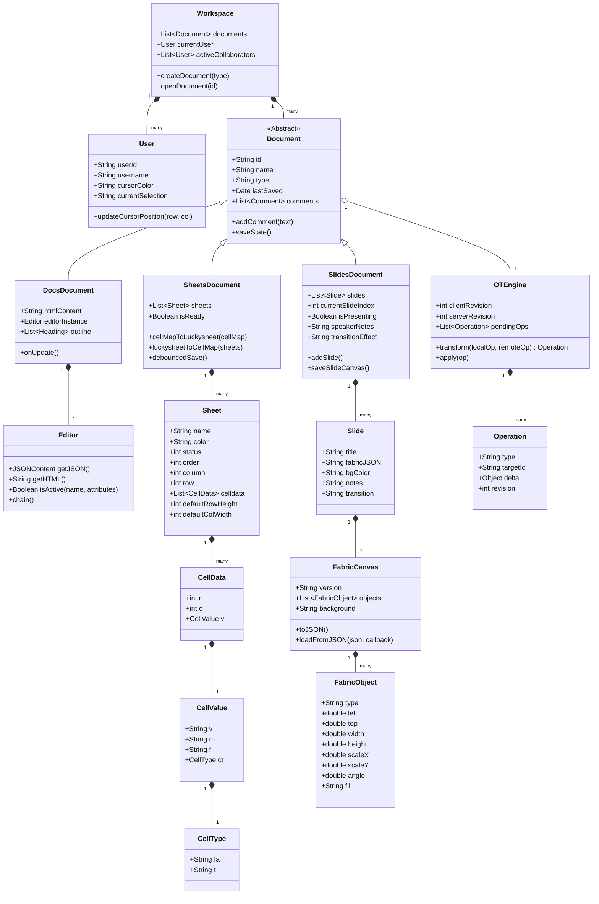
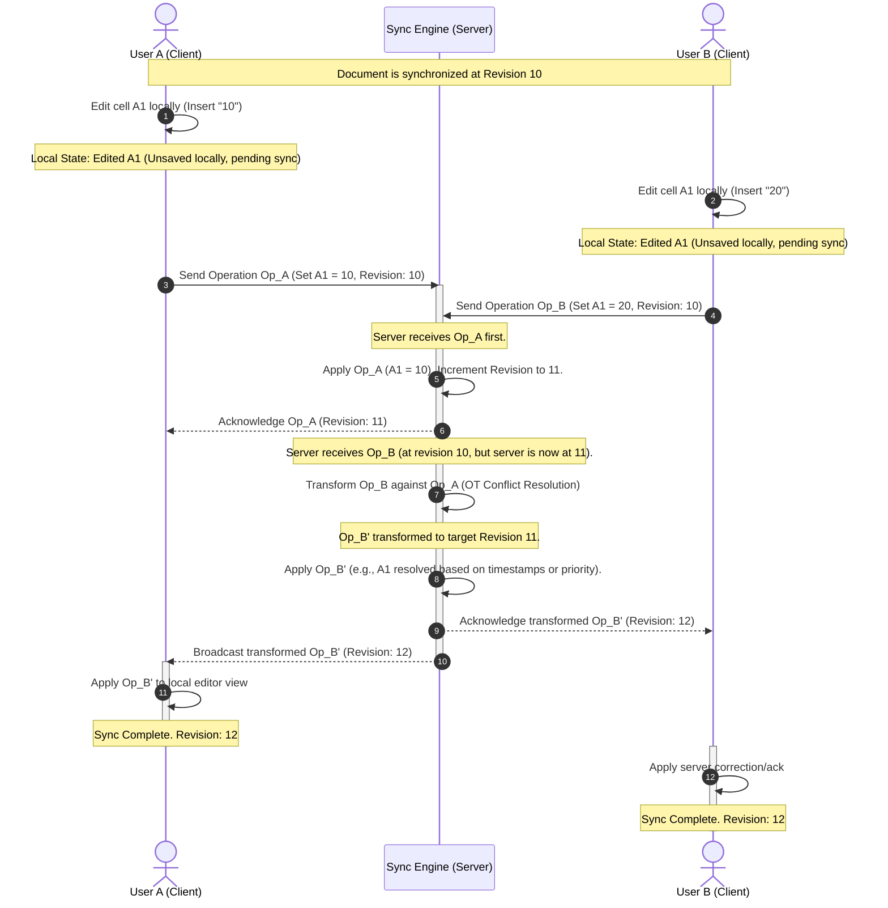
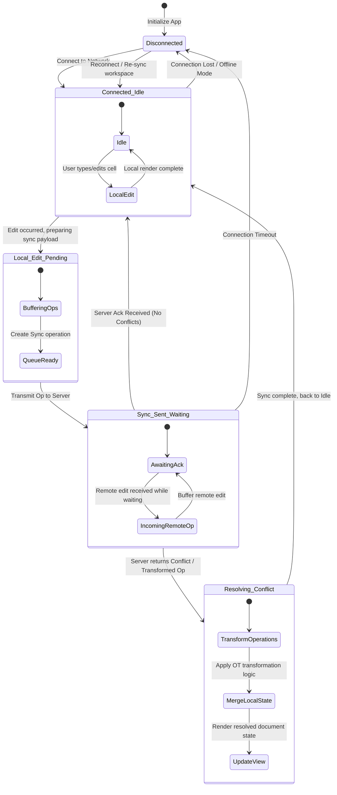

# UML Diagrams - Nexus Collaborative Suite

This document presents the UML diagrams for the **Nexus Collaborative Suite**, modeled using Mermaid.js. These diagrams represent the external behavior, internal structure, dynamic interaction, and lifecycle states of the collaborative system.

---

## 1. Use Case Diagram (External Dynamics)

The Use Case diagram shows the interactions between the primary **User**, the **Collaborative Peer** (simulated or remote user), the **Collaboration Server** (sync engine), and the system boundary.

```mermaid
rect User
    U["User"]
end
rect Remote
    R["Collaborative Peer (Sync Server)"]
end

subgraph Nexus Suite Boundary
    UC1("Manage Workspaces (Docs/Sheets/Slides)")
    UC2("Edit Document (Rich Text & Comments)")
    UC3("Edit Sheet (Cells & Formulas)")
    UC4("Edit Slide Deck (Add/Edit/Present)")
    UC5("Real-Time Collaboration & Chat")
    UC6("Resolve Synchronization Conflicts (OT)")
end

U --> UC1
U --> UC2
U --> UC3
U --> UC4
U --> UC5

UC2 <--> UC6
UC3 <--> UC6
UC4 <--> UC6

UC5 <--> R
UC6 <--> R
```

---

## 2. Class Diagram (Internal Statics)

The Class diagram details the objects and relations within the Nexus Collaborative Suite, including inheritance for document types, associations with users and operations, and helper engines like the `FormulaEvaluator` and `OTEngine`.



---

## 3. Sequence Diagram (External Dynamics - Collaborative Edit & Sync)

This Sequence Diagram depicts how User A and User B concurrently edit the same document. It details the client buffers, local changes, Operational Transformation (OT) conflict resolution on the Server (Sync Engine), and the update loop.



---

## 4. State Diagram (Internal Dynamics - Document Synchronization)

The State Diagram represents the lifecycle states of the Client's Sync Manager while coordinating local modifications with remote server operations.


